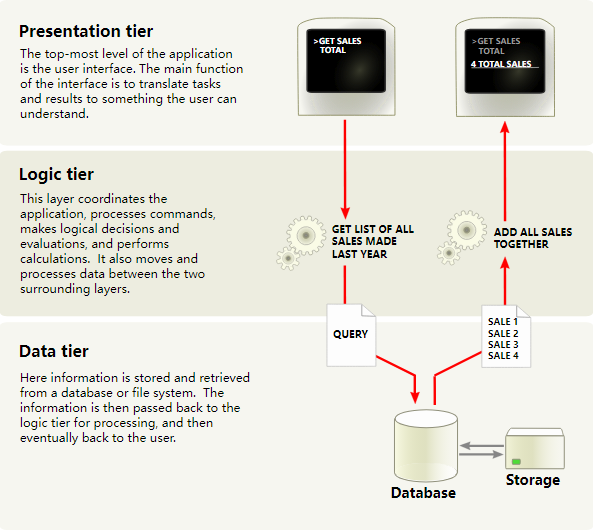

# 第 1 章：体系结构概述
## Multitier application
Odoo遵循多层架构，这意味着演示，业务 逻辑和数据存储是分开的。更具体地说，它使用三层架构 （图片来自维基百科）：

三层架构
表示层是 HTML5、JavaScript 和 CSS 的组合。逻辑层是独占的 用 Python 编写，而数据层仅支持 PostgreSQL 作为 RDBMS。

根据模块的范围，Odoo开发可以在这些层中的任何一层中完成。 因此，在继续之前，如果您没有，刷新您的记忆可能是个好主意 这些主题的中级水平。

为了完成本教程，您将需要非常基本的 HTML 知识和中级知识 Python 的水平。高级主题将需要更多其他学科的知识。有 大量教程可以免费访问，因此我们不能推荐一个教程，因为它取决于另一个教程 在你的背景上。

作为参考，这是官方的 Python 教程。

 注解

从15.0版本开始，Odoo正在积极过渡到使用自己内部开发的OWL 框架作为其表示层的一部分。旧版 JavaScript 框架仍受支持，但会随着时间的推移而被弃用。这将在 高级主题。

Odoo modules
服务器和客户端扩展都打包为模块，这些模块是 （可选）加载到数据库中。模块是以 单一用途。

Odoo模块可以向Odoo系统添加全新的业务逻辑，或者 更改和扩展现有业务逻辑。可以创建一个模块来添加您的 国家的会计规则对Odoo的通用会计支持，而 不同的模块可以添加对公交车队实时可视化的支持。

Odoo中的所有内容都以模块开始和结束。

术语：开发人员将他们的业务功能分组到Odoo模块中。主要面向用户 模块被标记为应用程序并公开为应用程序，但大多数模块不是应用程序。 模块也可以称为插件和Odoo服务器找到它们的目录 形成 .addons_path

## 模块的组成
Odoo模块可以包含许多元素：

### Business objects
业务对象（例如发票）被声明为 Python 类。中定义的字段 由于 ORM 层，这些类会自动映射到数据库列。

### Object views
定义 UI 显示

### Data files
声明模型数据的 XML 或 CSV 文件：

* views or reports,
* 配置数据（模块参数化、安全规则）、
* 演示数据
* 和更多

### Web controllers
处理来自 Web 浏览器的请求

### Static web data
IWeb 界面或网站使用的 mage、CSS 或 JavaScript 文件

这些元素都不是强制性的。某些模块可能只添加数据文件（例如，特定国家/地区 记帐配置），而其他人可能只添加业务对象。在本次培训期间，我们将 创建业务对象、对象视图和数据文件。

### Module structure
每个模块都是模块目录中的一个目录。模块目录 通过使用--addons-path选择。

Odoo模块由其清单声明。

当Odoo模块包含业务对象（即Python文件）时，它们被组织为带有文件的Python包。此文件包含各种 Python 的导入说明 文件。__init__.py

下面是一个简化的模块目录：

module
├── models
│   ├── *.py
│   └── __init__.py
├── data
│   └── *.xml
├── __init__.py
└── __manifest__.py

## Odoo Editions
Odoo有两个版本：Odoo企业版（许可和共享资源）和Odoo社区 （开源）。除了支持或升级等服务外，企业版还提供额外的服务 Odoo的功能。从技术角度来看，这些功能很简单 新模块安装在社区版本提供的模块之上。

准备好开始了吗？在编写实际代码之前，我们先进入下一章进行回顾 Odoo安装过程。即使Odoo已经在您的系统上运行，我们也强烈建议 您阅读本章以确保我们在开发新 应用.